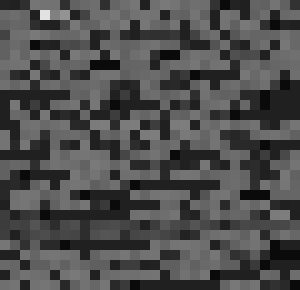

# data2img
> Data to image.  Exactly what it says

Converts a file, for example `data2img.py`, to an image, for example `data2img.png`:

```sh
./data2img.py data2img.py 30 29 data2img.png
```

Here's the result, scaled by a factor of 10 so you actually see something:


